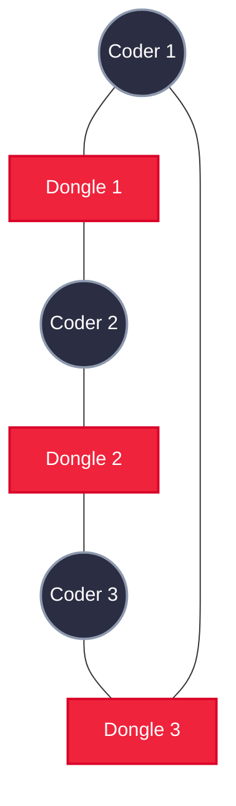
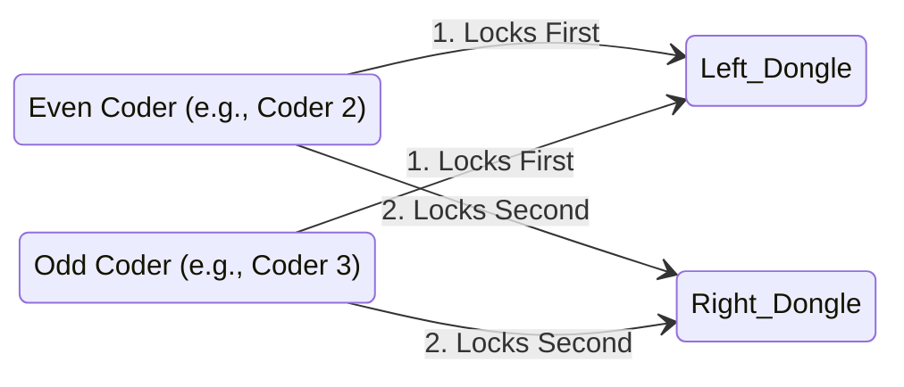
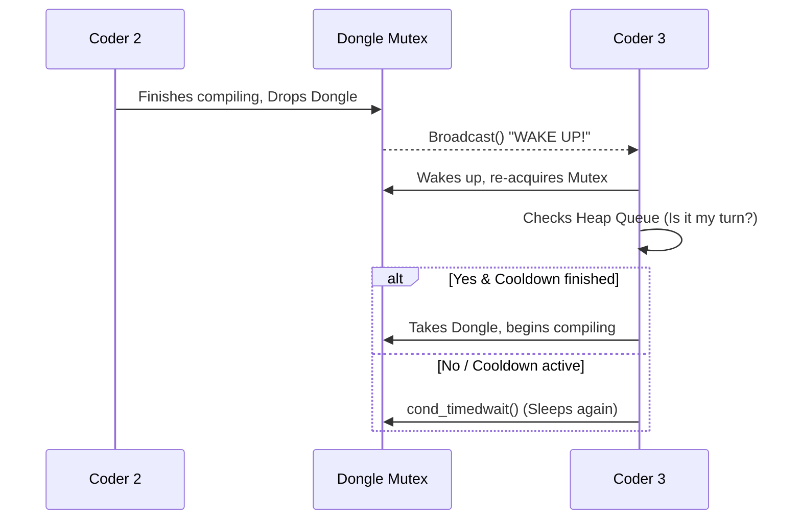

<div align="center">

# ⚡ Codexion: The Quantum Concurrency Engine
**A High-Performance POSIX Threads & Scheduling Simulation**

[]()
[]()
[]()
[]()

*Codexion is an advanced, strictly-timed concurrency simulation inspired by the classic Dining Philosophers problem, engineered to handle resource cooldowns, deterministic deadlocks, and dynamic priority scheduling.*

</div>

---

## 🧠 The Premise

In a time-sensitive collaborative workspace, multiple quantum **Coders** sit at a circular table. To compile their code, a coder must acquire the two **USB Dongles** immediately adjacent to them. 

If they wait too long to compile, they **burn out**. If they all grab one dongle at the same time, the system **deadlocks**. Your mission is to orchestrate the chaos.

This project is a deep dive into Operating System-level programming, utilizing bare-metal C, Mutexes, and Condition Variables to build a bulletproof, 0% CPU busy-waiting engine.

---

## 🚀 Key Features

- **Zero Busy-Waiting:** Implements `pthread_cond_timedwait` to sleep threads at the OS level during cooldowns, eliminating CPU frying.
- **Dynamic Priority Schedulers:** Choose between **FIFO** (First-In, First-Out) or **EDF** (Earliest Deadline First) to arbitrate resource contention.
- **Bulletproof Deadlock Prevention:** Utilizes a strict Resource Hierarchy (Odd/Even asymmetric fetching) to break Coffman's circular wait condition.
- **Microsecond Precision Monitor:** A detached watchdog thread detects starvation/burnout within a strict `<10ms` tolerance limit.
- **Thread-Safe Logging:** Standard output is fully serialized to prevent torn terminal reads.

---

## 📐 Architecture & Diagrams

### 1. The Circular Table Geometry
Dongles are shared resources. Coder $N$ and Coder $N+1$ compete for the exact same dongle, creating a localized bottleneck.



### 2. Deadlock Prevention (Resource Hierarchy)
If all coders grab their left dongle simultaneously, the system freezes permanently. Codexion solves this by forcing an asymmetric request order based on the coder's seat ID.



### 3. The Condition Variable Waiting Room
Instead of spinning `while(locked)`, coders enter an OS-level sleep state (`pthread_cond_wait`). When a dongle is released, a `broadcast` wakes the queue, and the **Binary Min-Heap** scheduler decides who wins.



---

## 🛠️ Usage & Installation

### Compilation
Build the highly-optimized binary using the provided `Makefile`:
```bash
git clone git@github.com:kh-a-lil/Concurrency-Engine.git
cd codexion/coders
make
```

### Execution
```bash
./codexion [coders] [burnout_ms] [compile_ms] [debug_ms] [refactor_ms] [required_compiles] [cooldown] [scheduler]
```

**Parameters:**
*   `coders`: Number of threads to spawn (and number of dongles).
*   `burnout_ms`: Maximum time a coder can survive without starting a compile.
*   `compile/debug/refactor`: Time taken for each respective action.
*   `required_compiles`: Simulation ends when all coders hit this target. (Optional behavior logic handled internally).
*   `cooldown`: Time a dongle must rest on the table before being taken again.
*   `scheduler`: Must be `fifo` (Arrival time) or `edf` (Earliest Deadline First).

**Example: The Survival Test**
5 coders, tight survival parameters, 5 compiles needed to win, EDF scheduling.
```bash
./codexion 5 800 200 200 200 5 10 edf
```

---

## 🔬 Under the Hood: FIFO vs EDF

Codexion implements a custom **O(log N) Priority Min-Heap** for each dongle. Because of the table's geometry, a single dongle's queue never exceeds a size of 2. 

*   **FIFO (Arrival Time):** The ticket priority is generated using `gettimeofday()` in microseconds. The first coder to arrive at the queue gets the dongle.
*   **EDF (Earliest Deadline First):** The ticket priority is calculated as `last_compile_start + burnout_time`. If a coder arrives late but is closer to death than the coder already waiting, the heap swaps them to index `0`, granting them the dongle and saving their life.

---

## 📜 Acknowledgments
*   Created as part of the **42 Network** curriculum.
*   Concurrency concepts heavily inspired by **Operating Systems: Three Easy Pieces (OSTEP)**.

